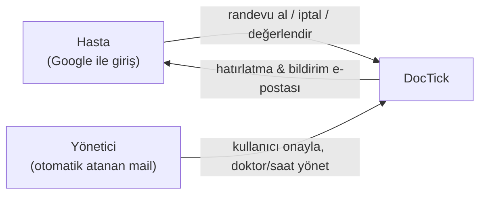

# 01 — Genel Bakış

## Nedir?

**DocTick**, hastaneler/klinikler için tasarlanmış, web tabanlı bir **online randevu sistemidir**. İki yüzeyi vardır:

- **Hasta yüzeyi** — Google ile giriş yapar, bölüm ve doktor seçer, müsait bir slota randevu alır, randevularını görür/iptal eder/değerlendirir, iletişim sayfasından mesaj gönderir.
- **Yönetici paneli** — kullanıcıları onaylar/reddeder, bölüm ve doktorları yönetir, her doktor için haftalık çalışma saatleri ızgarasını düzenler, e-posta/hatırlatma ayarlarını yapar, genel bakış panosunu izler.

Sistem, randevu oluşturmayı onaylayan, çift-rezervasyonu engelleyen ve hatırlatma e-postalarını otomatik gönderen tam çalışan bir arka uca bağlıdır.

## Temel özellikler

- **Google ile giriş** — ID-token sunucuda doğrulanır, oturum güvenli cookie ile tutulur (7 gün).
- **Rol/Statü tabanlı erişim** — Hasta / Yönetici rolleri; Beklemede / Aktif / Reddedildi statüleri. Yönetici onayı aktif işlem yapmanın önkoşuludur.
- **3 adımlı randevu sihirbazı** — Bölüm → Doktor → Tarih+Slot, anlık müsaitlik ile.
- **Çift-rezervasyon engeli** — aynı doktor+tarih+saat için tek Onaylı randevu; katmanlı garanti (uygulama + DB).
- **Haftalık çalışma planı** — yönetici, her doktor için 7 gün × 10 slot ızgarasını düzenler.
- **Otomatik hatırlatma** — `BackgroundService` her 5 dakikada, yaklaşan randevular için (varsayılan 24 saat önce) bir kez e-posta gönderir.
- **E-posta bildirimleri** — onay, iptal, hatırlatma, kullanıcı onay/red, iletişim formu.
- **Değerlendirme** — geçmiş randevular 1–5 yıldız puanlanabilir.
- **Yönetici panosu** — haftalık randevu, açık bölüm, aktif doktor, bekleyen kullanıcı istatistikleri + bugünün listesi.
- **OpenAPI / Scalar** — geliştirme ortamında interaktif API dokümantasyonu (`/scalar`).

## Teknoloji yığını

| Katman | Teknoloji | Not |
|---|---|---|
| **Backend** | ASP.NET Core 10 (`net10.0`) Minimal API | `backend/` |
| **ORM** | Entity Framework Core 10 | SQLite sağlayıcı |
| **Veritabanı** | SQLite (`doctick.db`) | tek dosya, `EnsureCreated` ile şema |
| **Kimlik doğrulama** | Google OAuth (ID-token) + ASP.NET Core cookie | `Google.Apis.Auth` ile doğrulama |
| **E-posta** | Resend REST API (raw `HttpClient`) | SDK yok |
| **Zamanlanmış iş** | `BackgroundService` + `PeriodicTimer` | 5 dakika aralıkla hatırlatma |
| **API dokümantasyonu** | `Microsoft.AspNetCore.OpenApi` + Scalar | Swashbuckle yok |
| **Frontend** | React 19 + TypeScript | Vite 8 (Oxc) ile derleme |
| **Router** | React Router **v8** | `createBrowserRouter` |
| **Sunucu durumu** | TanStack React Query v5 | veri çekme/önbellekleme |
| **Stil** | CSS custom properties + runtime CSS-in-JS (`dtInject`) | framework/ön işlemci yok |
| **Test** | xUnit (backend) | in-memory SQLite, partial index testleri |
| **Linter** | oxlint (frontend) | |

## Aktörler ve temel akış

## Kapsam dışı olanlar (bilinçli)

- Ödeme/finans entegrasyonu yok.
- Hastane içi (kayıt, muayene, reçete) süreçleri yok — yalnızca **randevu** alanı.
- Mobil uygulama yok (responsive web).
- Doktor için ayrı bir giriş rolü yok; doktorlar yönetici tarafından yönetilir.
