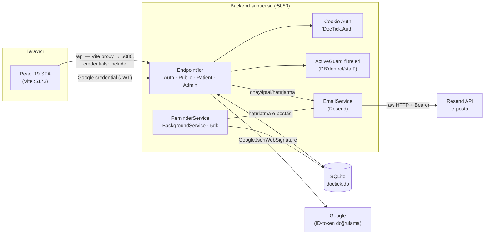
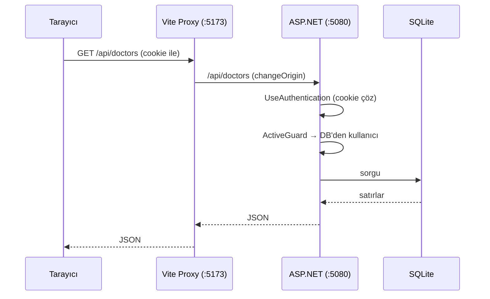

# 02 — Mimari

## Sistem mimarisi

Klasik iki katmanlı web uygulaması: tarayıcıda çalışan bir React SPA ve tek bir ASP.NET Core süreci içinde çalışan API + zamanlanmış iş. İletişim geliştirmede Vite'ın `/api` proxy'si ile **aynı köken** (same-origin) üzerinden olur, bu yüzden cookie sorunsuz akar ve CORS yapılandırması gerekmez.

## Katmanlar (backend)

`backend/` tek projedir (`DocTick.Api`), ancak iç mantıkta net bir ayrım vardır:

| Katman | Dosya(lar) | Sorumluluk |
|---|---|---|
| **Composition root** | `Program.cs` | Servis kaydı, middleware pipeline, şema oluşturma + seed |
| **Endpoint'ler** | `Endpoints/*.Endpoints.cs` | HTTP girişi, istek doğrulama, DTO eşleme |
| **Modeller** | `Models/Db.cs` | Entity'ler, `AppDb` DbContext, `OnModelCreating`, `DbSeeder`, `Slots`, enum'lar |
| **Servisler** | `Services/EmailService.cs`, `Services/ReminderService.cs` | E-posta gönderimi ve zamanlanmış hatırlatma |
| **Yetkilendirme** | `Auth/Authz.cs` | Custom claim tipleri, `CurrentUser`, `ActiveGuard` filtreleri |

Servis katmanı ince tutulmuştur: iş mantığının büyük kısmı endpoint'lerde doğrudan `AppDb` üzerinden çalışır. Bu bilinçli bir sadeleştirmedir — ADR-0001.

## İstek yaşam döngüsü (özet)

## Veri akışı özetleri

- **Kimlik doğrulama**: tarayıcı → Google credential (JWT) → `POST /api/auth/google` → sunucu token'ı doğrular, kullanıcıyı bul/oluştur, cookie basar → `/api/auth/me` ile güncel kullanıcı okunur. Detay: [06](06-kimlik-dogrulama.md).
- **Randevu**: sihirbaz → `POST /api/appointments` → uygulama kontrolü + transaction + `Code` atama → partial unique index çakışırsa `409`. Detay: [07](07-randevu-akisi.md).
- **Hatırlatma**: `ReminderService` (5dk tick) → `Confirmed` + `ReminderSentAt == null` randevuları tarar → pencere içindeyse e-posta gönderip `ReminderSentAt` yazar.

## Güvenilirlik notları

- **Çift-rezervasyon**: uygulama seviyesi kontrolü **artı** SQLite partial unique indeks — eşzamanlı iki istekten ikisi de yazamaz. Çakışma `SqliteException` (hata 19) olarak yakalanır ve `409 Conflict` döner.
- **E-posta en-iyi-effort (best-effort)**: gönderim başarısız olsa bile tetikleyen DB yazımı geri alınmaz. Yalnızca `ReminderService`'in hatırlatması bağımsız kaydedilir — biri başarısız olursa diğerleri etkilenmez, başarısız olan bir sonraki tick'te tekrar denenir.
- **"Done" türetilir**: `Appointment` tablosunda durum sütunu yok; okuma anında tarih+saat geçmişse `done` olarak hesaplanır. Daha az tutarsızlık yüzeyi.
