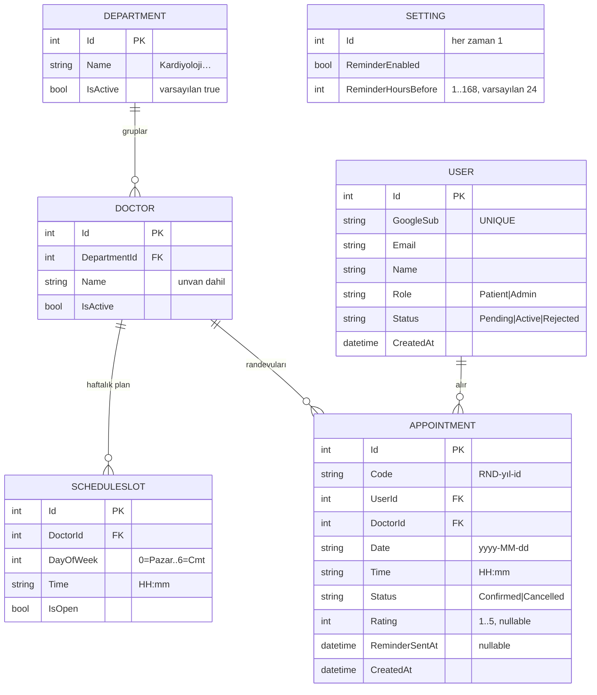

# 04 — Veri Modeli

Kaynak: `backend/Models/Db.cs`. Altı tablo, üç enum. Şema `Database.EnsureCreated()` ile modelden üretilir (migration yok — ADR-0001).

## ERD



> `SETTING` singleton tablodur (tek satır, `Id=1`); ilişkisi yoktur. Uygulama ayarlarını (hatırlatma) tutar.

## Enum'lar (`Db.cs:5-7`)

| Enum | Değerler | Not |
|---|---|---|
| `UserRole` | `Patient`, `Admin` | tek hastane, tek yönetici varsayımı |
| `UserStatus` | `Pending`, `Active`, `Rejected` | yönetici onayı akışını yönlendirir |
| `ApptStatus` | `Confirmed`, `Cancelled` | **`Done` enum'da yok** — türetilir (aşağıda) |

Üçü de veritabanında **metin** olarak saklanır (`.HasConversion<string>()`, `Db.cs:96-98`) — böylece partial indeks filtresi (`WHERE "Status" = 'Confirmed'`) ve sorgular okunaklı olur.

## Çift-rezervasyon engeli — partial unique index

```csharp
// Db.cs:105-108
b.Entity<Appointment>()
    .HasIndex(a => new { a.DoctorId, a.Date, a.Time })
    .IsUnique()
    .HasFilter("\"Status\" = 'Confirmed'");
```

Aynı (doktor, tarih, saat) üçlüsü için **yalnızca bir** `Confirmed` randevu olabilir. Filtre `Confirmed` üzerinde olduğu için:

- İki eşzamanlı istek aynı slota yazamaz — ikincisi `SqliteException` (hata 19) alır, endpoint bunu `409 Conflict`'a çevirir.
- İptal edilen (`Cancelled`) slot **tekrar** rezerve edilebilir — çünkü filtre onu dışlar.

Bu, uygulama seviyesi kontrolünün **üzerine** konan sert bir DB garantisi. Gerekçe ve alternatif reddi: [ADR-0003](adr/0003-partial-unique-index-cift-rezervasyon.md).

## "Done" türetilmiş durum

`Appointment` tablosunda "tamamlandı" durumu **yok**. Hasta DTO'su okuma anında hesaplar (`PatientEndpoints.cs:143-148`):

- `Status == Confirmed` **ve** `Date + Time <= DateTime.Now` → görüntüleme `done`
- aksi halde depolanan `Status` (`confirmed` / `cancelled`)

> ponytail: bir durum sütunu ekleme yerine türetilmiş görünüm — zaman tabanlı geçişin tutarsızlık yüzeyini azaltır.

## Randevu kodu

`Code`, oluşturma transaction'ı içinde atanır: ilk `SaveChanges` ile `Id` alınır, sonra `Code = $"RND-{year}-{Id:D4}"` (`PatientEndpoints.cs:73`). Örn: `RND-2026-0007`. Transaction, boş `Code`'lu yetim satır kalmamasını sağlar.

## Seed verisi (`DbSeeder.SeedAsync`, `Db.cs:119-165`)

Yalnızca `Departments` boşsa çalışır (idempotent):

- **5 bölüm**: Kardiyoloji, Dermatoloji, Göz Hastalıkları, Ortopedi, Kulak Burun Boğaz.
- **6 doktor**: her birine bölümden atanır; her doktor için **tam haftalık** `ScheduleSlot` ızgarası (7 gün × 10 slot) oluşturulur — hafta içi açık, hafta sonu kapalı.
- **Setting** satırı `OnModelCreating.HasData` ile (`Db.cs:110-115`): hatırlatma açık, 24 saat.
- **Admin kullanıcısı seed edilmez** — `GoogleSub` bilinmediği için. İlk Google girişinde, e-posta `Admin:Email` ile eşleşirse rol atanır. (`Db.cs:161-163`)

## Sabit slot takvimi (`Slots`, `Db.cs:74-82`)

```text
Slots.All       = [09:00, 09:30, 10:00, 10:30, 11:00, 11:30, 13:30, 14:00, 14:30, 15:00]
Slots.Days      = [Pzt=1, Sal=2, Çar=3, Per=4, Cum=5, Cmt=6, Paz=0]   (görüntüleme sırası)
Slots.DefaultOpenDays = [Pzt..Cum]   (hafta sonu slotları oluşturulur ama kapalı gelir)
```

Öğle arası (12:00–13:30 arası) bilinçli olarak boş bırakılmıştır.
