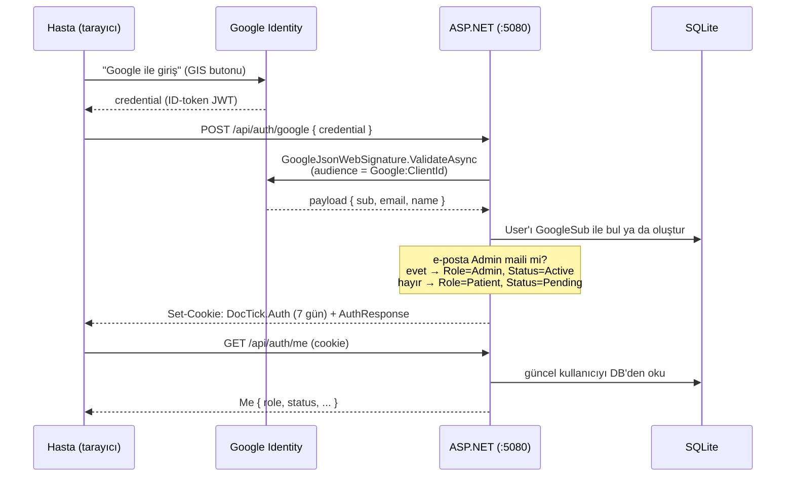
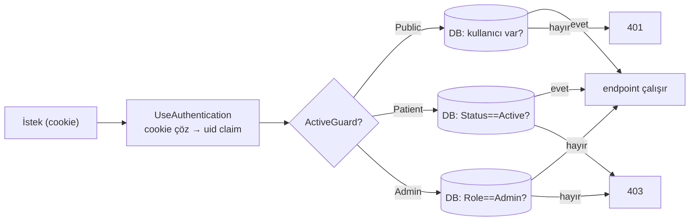

# 06 — Kimlik Doğrulama & Yetki

DocTick'te kimlik doğrulama **Google OAuth ID-token + sunucu tarafı cookie** modeliyle yapılır. Şifre tutulmaz, oturum veritabanında değil. Gerekçe ve alternatif reddi: [ADR-0002](adr/0002-google-oauth-idtoken-cookie.md).

## Google ile giriş akışı

## Cookie yapılandırması (`Program.cs:21-32`)

| Özellik | Değer | Neden |
|---|---|---|
| `Name` | `DocTick.Auth` | — |
| `HttpOnly` | `true` | JavaScript erişemez (XSS ile çalınmayı engeller) |
| `SameSite` | `Lax` | Vite proxy aynı köken yaptığı için yeterli |
| `SecurePolicy` | `Always` | Her zaman HTTPS bayrağı; localhost secure sayılır |
| `ExpireTimeSpan` | 7 gün | kalıcı oturum |

`OnRedirectToLogin` / `OnRedirectToAccessDenied` override'ları API için yönlendirme yerine **`401`/`403`** döner (`Program.cs:30-31`) — SPA açısından doğru davranış.

## Yetkilendirme — `ActiveGuard` (`Auth/Authz.cs`)

Oturum 7 gün yaşadığı halde, bir kullanıcının rol/statüsü bu süre içinde değişebilir (yönetici onaylar/reddeder, yönetici atar). Claim tabanlı policy'ler **stale** (eski) kalırdı. Bunun yerine iki endpoint filtresi **her istekte DB'yi okur**:

- `ActiveGuard.Patient` — kullanıcı var **ve** `Status == Active`, değilse `403`.
- `ActiveGuard.Admin` — `Role == Admin`, değilse `403`.

Gerekçe: stale claim problemi. Ayrıntı: [ADR-0004](adr/0004-activeguard-endpoint-filter.md). `CurrentUser.Uid(p)` custom `"uid"` claim'ini okur; claim tipleri `ClaimTypes2` içinde (`uid`, `role`, `status`).

## Yöneticinin otomatik atanması (`AuthEndpoints.cs:37-62`)

`Admin:Email` yapılandırma anahtarı (şu an `tahakeskin06@hotmail.com`) ile eşleşen e-postayla ilk Google girişi:

- **Yeni kullanıcı** → `Role=Admin, Status=Active` olarak oluşturulur.
- **Mevcut kullanıcı** (daha önce hasta olarak girmişse) → satır içinde `Admin/Active`'e yükseltilir.

Bu yüzden veritabanı seed'inde admin satırı yoktur — ilk giriş anında ortaya çıkar. (`Db.cs:161-163`)

## İstemci tarafındaki yansıması

- Her fetch `credentials: 'include'` gönderir (`client.ts:39`).
- `403` yanıtı → `location.reload()` (`client.ts:46`): sayfa yeniden `/api/auth/me` çağırır, `ActiveGuard`'ın yeni kararı uygulanır, rota guard kullanıcıyı doğru yere yönlendirir. Yani yönetici bir kullanıcıyı reddettiğinde, kullanıcının açık oturumu bir sonraki isteğinde `StatusScreen`'e düşer — manuel yenileme gerekmez.

## Güvenlik notları

- Şifre/salt yok — Google'a外包 edilmiş.
- ID-token sunucuda `audience` ile doğrulanır; istemci doğrulamasına güvenilmez.
- `SecurePolicy=Always` + `HttpOnly` + `SameSite=Lax` kombinasyonu.
- **Bilinen sınır (test/demo):** Resend gönderim domaini doğrulanana dek tüm e-posta `Resend:RedirectTo` adresine yönlendirilir — bkz. [ADR-0005](adr/0005-resend-raw-http-redirect-to.md). Üretime almadan önce domain doğrulanmalı.
