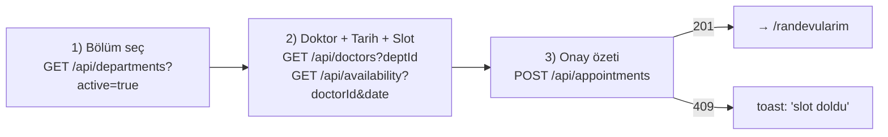
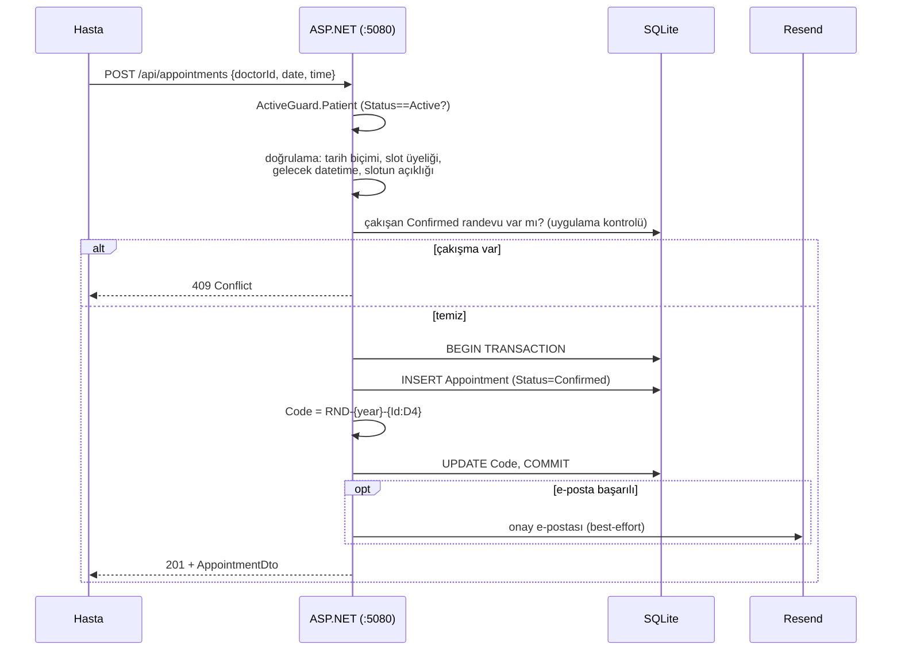

# 07 — Randevu Akışı

Randevu oluşturma, sistemin kalbidir. İstemci tarafında 3 adımlı bir sihirbaz, sunucu tarafında doğrulama + transaction + çift-rezervasyon garantisi.

## 3 adımlı sihirbaz (frontend, `Booking.tsx`)



- Adım 2'de tarih, bugünden itibaren **14 gün** ileriye kısıtlı; saatler sabit `TIMES` dizisinden (10 slot).
- Müsaitlik anlık çekilir: açık slotlar − onaylı randevular (bugün için geçmiş saatler hariç).
- `409` çakışması kullanıcıya "bu saat doldu" toast'ı olarak gösterilir, sihirbaz aynı yerde kalır.

## Oluşturma — sunucu tarafı (`PatientEndpoints.cs:44-92`)



## Çift-rezervasyon engeli — katmanlı garanti

Aynı (doktor, tarih, saat) için iki eşzamanlı istek geldiğinde, her ikisi de uygulama seviyesi kontrolünden geçebilir (race). **İkinci savunma hattı** SQLite partial unique indeksidir (`Db.cs:105-108`):

```text
UNIQUE (DoctorId, Date, Time) WHERE "Status" = 'Confirmed'
```

- İkinci `INSERT` `SqliteException` (hata 19) alır.
- Endpoint bunu yakalar ve `409 Conflict` döner (`PatientEndpoints.cs:77-81`).
- İptal edilen slot tekrar rezerve edilebilir — filtre yalnız `Confirmed`'u kapsar.

Gerekçe ve testi: [ADR-0003](adr/0003-partial-unique-index-cift-rezervasyon.md), [10-testler.md](10-testler.md).

## Randevu kodu ataması

`Code`, **transaction içinde** iki aşamada atanır:

1. İlk `SaveChanges` → DB `Id` üretir.
2. `Code = $"RND-{year}-{Id:D4}"` hesaplanır, ikinci `SaveChanges` → `COMMIT`.

Bu sıra, boş `Code`'lu yetim satır kalmamasını sağlar (transaction atomik). Örn: 7. randevu → `RND-2026-0007`.

## Yan akışlar

- **İptal** (`POST /api/appointments/{id}/cancel`) → `Status=Cancelled`; en-iyi-effort iptal e-postası. Slot tekrar müsait hale gelir.
- **Değerlendirme** (`POST /api/appointments/{id}/rating`) → `Rating` (1-5); yalnızca `Confirmed` ve başlangıcı geçmiş randevularda (`done` görünümlü).
- **Hatırlatma** → `ReminderService` tarafından, ayrı bir akış — [09](09-altyapi-calisma.md).

## E-posta en-iyi-effort kuralı

Onay/iptal e-postası gönderimi başarısız olsa bile **randevu DB yazımı geri alınmaz**. E-posta, işlemin yan etkisidir, koşulu değil. (`PatientEndpoints.cs:93`) Bu tutarlılık/erişilebilirlik tercihidir — randevu alınır, e-posta en sonra gelir.
