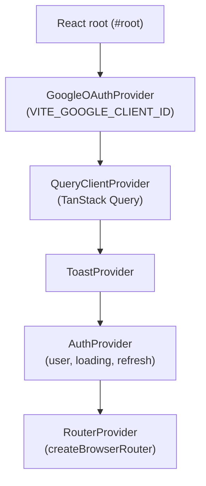
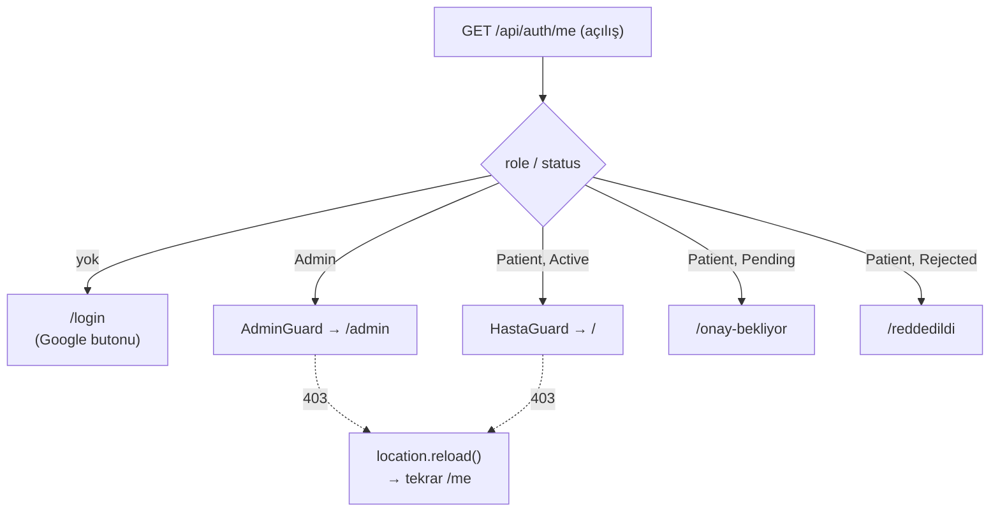

# 08 — Frontend

Vite 8 + React 19 + TypeScript SPA. Türkçe arayüz (`lang="tr"`). Kaynak: `frontend/src/`.

## Sağlayıcı zinciri (`main.tsx`)

`AuthProvider`, açılışta `/api/auth/me` çağırır; sonuç beklenirken bir `Splash` gösterilir.

## Rota haritası (`router.tsx`)

İki guard her şeyi sarar: `HastaGuard` (hasta yüzeyi) ve `AdminGuard` (yönetici paneli). Yanlış rol/statü → doğru yere yönlendirme.

| Yüzey | Rota | Bileşen | Açıklama |
|---|---|---|---|
| Genel | `/login` | `Login` | Bölünmüş ekran Google giriş; zaten girdiyse yönlendirir |
| Genel | `/onay-bekliyor` | `StatusScreen kind="pending"` | Onay bekleyen kullanıcı ekranı |
| Genel | `/reddedildi` | `StatusScreen kind="rejected"` | Reddedilen kullanıcı ekranı |
| **Hasta** | `/` | `Home` | Karşılama + yaklaşan randevu + aksiyon kartları |
| Hasta | `/randevu-al` | `Booking` | 3 adımlı sihirbaz (bölüm→doktor→slot) |
| Hasta | `/randevularim` | `Appointments` | Sekmeli liste: yaklaşan / geçmiş / iptal |
| Hasta | `/iletisim` | `Iletisim` | İletişim formu + harita |
| **Admin** | `/admin` | `Overview` | 4 istatistik + bugünün randevuları |
| Admin | `/admin/bolumler` | `Departments` | Bölüm CRUD |
| Admin | `/admin/doktorlar` | `Doctors` | Doktor CRUD |
| Admin | `/admin/saatler` | `Schedule` | 7×10 haftalık saat ızgarası |
| Admin | `/admin/eposta` | `EmailSettings` | Hatırlatma aç/kapa + saat-önce |
| Admin | `/admin/kullanicilar` | `Users` | Onayla/redet/sil |

> Doktor için ayrı bir istemci rolü yok; `Me.role` yalnızca `'Admin' | 'Patient'` (`client.ts:8`).

## API client (`client.ts`)

Tek bir `api<T>(path, opts)` yardımcısı `fetch` sarar. Önemli davranışlar:

- **Kimlik**: her istek `credentials: 'include'` gönderir — oturum cookie. `opts` önce yayılır, sonra `credentials`/`headers` zorlanır (çağıran override edemez).
- **`401`** → `ApiError(401, 'Oturum açılmamış')`.
- **`403`** → `location.reload()` (rol/statü değişikliği anında yansır) sonra `ApiError(403)`.
- **diğer non-OK** → gövde metniyle `ApiError(status, text)`.

Endpoint yüzeyi (`Api` nesnesi, `client.ts:58-93`): `me, loginGoogle, logout`, `departments, doctors, availability`, `contact`, `myAppointments, createAppointment, cancelAppointment, rateAppointment`, ve admin bloğu (`adminOverview, adminAppointments, adminUsers, approveUser/rejectUser/deleteUser, adminDepartments…, adminDoctors…, getSchedule, saveSchedule, getSettings, saveSettings`).

## Tasarım sistemi

**CSS framework yok.** İki katman:

1. **Token'lar** (`src/styles/tokens/*.css`, `:root` üzerinde CSS custom property):
   - Renk: `--blue-50..900` marka skalası, `--ink-*` nötr, semantik yeşil/amber/kırmızı + `--status-*`. `--brand = #1B5493`.
   - Tipografi: display `Sora`, gövde `IBM Plex Sans`, mono `IBM Plex Mono` (latin-ext → Türkçe).
   - Boşluk: `--sp-1..16`, `--page-max: 1440px`, `--card-pad: 20px`.
   - Efekt: `--radius-*`, `--shadow-*`, `--dur-fast: 120ms`.
2. **Runtime CSS-in-JS** (`dtInject`, `forms/Button.jsx:18`): her `.jsx` bileşen kendi CSS dizesini tutar ve ilk render'da `<style id=…>` olarak `<head>`'e **bir kez** (idempotent) enjekte eder. Bağımlılıksız, kapsamlı stil.

Bileşen kütüphanesi:

| Grup | Bileşenler |
|---|---|
| display | `Icon` (Lucide glyph seti), `Logo`, `Card`, `Badge`, `Rating`, `TimeSlot` |
| forms | `Button` (+`dtInject`), `IconButton`, `Input`/`Textarea`, `Select`, `Switch` |
| feedback | `Dialog`, `Tabs`, `Toast` |

> **Karışık `.tsx`/`.jsx`**: mantık/sayfalar tipli (`.tsx`); tasarım-sistemi ilkel bilinçli tipsiz `.jsx` (`vite-env.d.ts` `declare module '*.jsx'` → `any`).

## İstemci sabitleri (not)

- Rezervasyon saatleri `TIMES`/`Slots.All` — `Booking.tsx` ve `Schedule.tsx`'te **çoğaltılmış** kopya (backend `Slots.All` ile aynı 10 slot).
- 14 günlük rezervasyon penceresi (`Booking.tsx:18`).
- Hastane adresi/koordinatları (`Iletisim.tsx:11-19`) hardcoded.

## Test

İstemci tarafı test kurulumu yok (`package.json`'da test runner yok). Lint: `oxlint` (`react/rules-of-hooks: error`).
