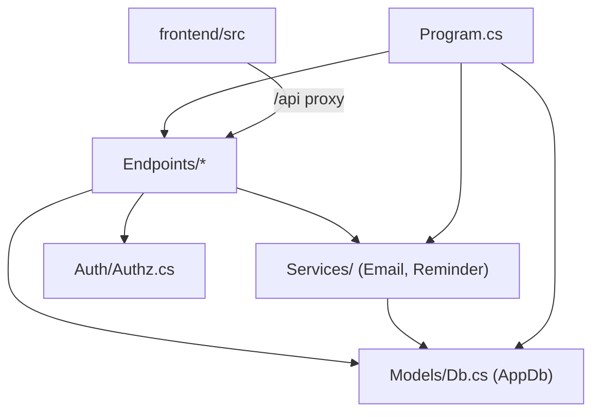

# 03 — Proje Yapısı

Teslim edilen **tüm repo** aşağıdadır. İki ana bölüm vardır: **🟦 uygulama** (değerlendirilen ürün) ve **🛠️ geliştirme araçları** (Claude Code + memkraft + skills katmanı; ürünün parçası değil, geliştirme sürecinin). Ayrıntı: [11-gelistirme-araclari.md](11-gelistirme-araclari.md).

```
DocTick/
├── 🟦 backend/                         ASP.NET Core 10 Minimal API
│   ├── DocTick.Api.csproj              net10.0, NuGet bağımlılıkları
│   ├── Program.cs                      ⭐ composition root: pipeline, servis kaydı, seed
│   ├── appsettings.json                yapılandırma (anahtarlar → 09)
│   ├── appsettings.Development.json    yalnızca log seviyesi override
│   ├── doctick.db                      SQLite (runtime, EnsureCreated ile oluşur)
│   ├── Properties/launchSettings.json  http://localhost:5080 profili
│   ├── Models/
│   │   └── Db.cs                       ⭐ entity'ler, AppDb, OnModelCreating, DbSeeder, Slots
│   ├── Auth/
│   │   └── Authz.cs                    custom claim tipleri, CurrentUser, ActiveGuard filtreleri
│   ├── Endpoints/
│   │   ├── AuthEndpoints.cs            /api/auth/* (google, me, logout)
│   │   ├── PublicEndpoints.cs          /api/departments, doctors, availability, contact
│   │   ├── PatientEndpoints.cs         /api/appointments/* (CRUD, cancel, rating)
│   │   └── AdminEndpoints.cs           /api/admin/* (~18 uç)
│   └── Services/
│       ├── EmailService.cs             Resend raw HTTP + HTML şablonları
│       └── ReminderService.cs          BackgroundService, 5dk hatırlatma
│
├── 🟦 backend.Tests/                   xUnit test projesi
│   ├── DocTick.Api.Tests.csproj
│   └── UnitTest1.cs                    7 test (→ 10)
│
├── 🟦 frontend/                        Vite 8 + React 19 + TypeScript SPA
│   ├── package.json, vite.config.ts, tsconfig*.json
│   ├── index.html                      lang="tr", #root mount
│   ├── .env, .env.example              VITE_GOOGLE_CLIENT_ID
│   ├── public/                         favicon.svg, logo.svg, logo-icon.svg, icons.svg
│   └── src/
│       ├── main.tsx                    ⭐ provider zinciri + RouterProvider
│       ├── router.tsx                  ⭐ createBrowserRouter + HastaGuard/AdminGuard
│       ├── vite-env.d.ts               tip bildirimleri (declare module '*.jsx')
│       ├── auth/Auth.tsx               AuthProvider context (user, loading, refresh)
│       ├── api/client.ts               ⭐ tek fetch-tabanlı API client
│       ├── components/
│       │   ├── ToastProvider.tsx
│       │   ├── display/                Icon, Logo, Card, Badge, Rating, TimeSlot  (.jsx)
│       │   ├── forms/                  Button(+dtInject), IconButton, Input, Select, Switch (.jsx)
│       │   └── feedback/               Dialog, Tabs, Toast  (.jsx)
│       ├── pages/
│       │   ├── common/                 Login, StatusScreen            (.tsx)
│       │   ├── hasta/                  HastaLayout, Home, Booking, Appointments, Iletisim (.tsx)
│       │   └── admin/                  AdminLayout, Overview, Departments, Doctors,
│       │                               Schedule, EmailSettings, Users  (.tsx)
│       └── styles/
│           ├── styles.css              giriş + global reset
│           └── tokens/                 fonts, colors, typography, spacing, effects (.css)
│
├── 🟦 docs/                            ⭐ BU DÖKÜMANTASYON (yeni)
│   ├── README.md                       indeks
│   ├── 01..11-*.md                     teknik belgeler
│   ├── ekler/guvenlik-notlari.md
│   └── adr/                            mimari karar kayıtları
│
├── 🟦 CONTEXT.md                       ⭐ alan sözlüğü (ubiquitous language)
├── 🟦 baslat.bat                        tek tıkla backend + frontend başlatma
├── 🟦 admin.url, kullanici.url          tarayıcı kısayolları
│
├── 🛠️ CLAUDE.md                        Claude Code proje rehberi (ponytail kuralları + notlar)
├── 🛠️ PONYTAIL-KILAVUZ.md, IMPECCABLE-KILAVUZ.md
├── 🛠️ .claude/skills/, .agents/skills/  41 skill (mattpocock/skills kopyası)
├── 🛠️ data/skills/, skills/              skill kopyaları
├── 🛠️ memory/                            memkraft memory katmanı (facts, decisions, sessions…)
├── 🛠️ .venv/                             proje-local Python venv (memkraft için)
├── 🛠️ scripts/check_memkraft.py          memory katmanı doğrulama
├── 🛠️ .gitignore
└── 🛠️ *.txt                              notlar (tasarım iyileştirmesi, Google client id)
```

> ⭐ = mimari anlamı en yoğun dosyalar. Değerlendirmede öncelikli okunması önerilir: `backend/Program.cs`, `backend/Models/Db.cs`, `frontend/src/router.tsx`, `frontend/src/api/client.ts`, `frontend/src/main.tsx`.

## Mimari bağımlılık yönü



Bağımlılık hep içeriye (modeller/servislere) doğru akar; döngü yok. `Models/Db.cs` ortak çekirdektir — hem entity tanımları hem `OnModelCreating` kısıtları hem `DbSeeder` orada.
