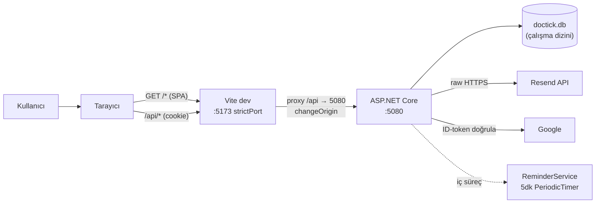

# 09 — Altyapı & Çalışma

## Çalışma-zamanı topolojisi

Geliştirmede iki süreç yan yana çalışır. Vite proxy'si `/api`'yi backend'e taşıdığı için tarayıcı açısından her şey **tek köken** (same-origin) — cookie akar, CORS yok.



| Süreç | Port | Nasıl başlatılır |
|---|---|---|
| Frontend (Vite) | **5173** (`strictPort`) | `cd frontend && npm run dev` |
| Backend (ASP.NET) | **5080** | `cd backend && dotnet run --urls http://localhost:5080` |

> **5173 zorunludur**: Google OAuth yetkili JS kaynağı yalnız `http://localhost:5173`'tür. Port kayarsa Google giriş çalışmaz (`vite.config.ts:9`).

## Tek tıkla başlatma — `baslat.bat`

Repo kökünde. İki ayrı komut penceresi açar (UTF-8 kod sayfası `chcp 65001` ile), frontend tarayıcıyı otomatik açar:

```bat
start "DocTick Backend (5080)" cmd /k "cd /d backend && dotnet run --urls http://localhost:5080"
start "DocTick Frontend (5173)" cmd /k "cd /d frontend && npm run dev -- --open"
```

Durdurmak için pencereleri kapatmak (veya `Ctrl+C`) yeterli.

## Yapılandırma anahtarları

### Backend — `backend/appsettings.json`

| Anahtar | Açıklama | Varsayılan / Not |
|---|---|---|
| `ConnectionStrings:Default` | SQLite bağlantısı | `Data Source=doctick.db`; boşsa fallback (`Program.cs:11`) |
| `Google:ClientId` | OAuth Web Client ID | **eksikse `500`** (`AuthEndpoints.cs:22-23`) |
| `Admin:Email` | Otomatik yönetici atanacak e-posta | boş olabilir |
| `Resend:ApiKey` | Resend API anahtarı | boşsa e-posta sessiz no-op |
| `Resend:FromEmail` | Gönderen adres | `onboarding@resend.dev` (test gönderici) |
| `Resend:FromName` | Gönderen adı | `DocTick` |
| `Resend:RedirectTo` | Test yönlendirme adresi | domain doğrulanana dek tüm posta buraya |

> ASP.NET Core config sıralaması: `appsettings.json` → `appsettings.{Env}.json` → **ortam değişkenleri** → user-secrets. Üretimde gerçek anahtarları **ortam değişkeni** olarak verin: `Resend__ApiKey`, `Google__ClientId`, `Admin__Email`, `ConnectionStrings__Default` (çift alt çizgi = bölüm ayracı). Sıfır kod değişikliği.

### Frontend — `frontend/.env`

```env
VITE_GOOGLE_CLIENT_ID=<Google OAuth Web Client ID>
```

`main.tsx` (GoogleOAuthProvider) ve `Login.tsx` (render kontrolü) okur. Ayarlı değilse giriş sayfasında kırmızı uyarı gösterilir, Google butonu çıkmaz (`Login.tsx:100`).

## İlk kurulum

```bash
# Backend
cd backend
dotnet restore        # NuGet paketleri
dotnet run --urls http://localhost:5080   # EnsureCreated + seed (5 bölüm, 6 doktor)

# Frontend
cd ../frontend
npm install
npm run dev
```

İlk `dotnet run`'da `EnsureCreated` şemayı oluşturur ve `DbSeeder` tohum veriyi ekler (bölümler boşsa). `doctick.db` çalışma dizininde oluşur.

## Üretim (production) notları

Bu proje geliştirme/demo odaklıdır; üretime almadan önce:

1. **Anahtarları taşıyın** — `appsettings.json`'daki gerçek anahtarları ortam değişkenine/user-secrets'e; dosyada yer tutucu bırakın. → [guvenlik-notlari.md](ekler/guvenlik-notlari.md).
2. **Frontend derleyin** — `npm run build` → `frontend/dist/`. Statik dosyaları ASP.NET statik dosya middleware'i veya ayrı bir web sunucusuyla servis edin; `/api` yine backend'e.
3. **HTTPS** — `SecurePolicy=Always` HTTPS gerektirir; proxy/rev-proxy arkasında `ForwardedHeaders` eklemek gerekebilir.
4. **Resend domaini** — `onboarding@resend.dev` yalnız test göndericidir; `RedirectTo` köprüsünü kaldırın, doğrulanmış bir gönderim domaini + `FromEmail` kullanın.
5. **Google Console** — yetkili JS kaynağı ve varsa yönlendirme URI'lerini üretim alan adıyla güncelleyin.
6. **SQLite** — tek dosya, dosya kilidi; çoklu örnek için PostgreSQL'e geçiş düşünün (sağlayıcı zaten EF Core; değişim düşük maliyetli).
7. **Migration** — `EnsureCreated` modelden şema üretir ama şema değişikliklerini taşımaz. Model sabitleşince EF migrations'a geçin.

## ReminderService zamanlaması

`AddHostedService<ReminderService>` ile kayıtlı (`Program.cs:18`). `PeriodicTimer` ile **5 dakikada bir** çalışır (`ReminderService.cs:10,14`):

- `Setting` okunur; `ReminderEnabled=false` ise erken dönüş.
- `Confirmed` + `ReminderSentAt == null` randevular yüklenir.
- `ReminderWindow.IsDue(start, now, hours)` → `start > now && start <= now+hours` ise hatırlatma e-postası gönderilir, `ReminderSentAt = now` yazılır.
- Her randevu **bağımsız** kaydedilir — biri başarısız olursa diğerleri etkilenmez, başarısız olan bir sonraki tick'te denenir.

`ReminderHoursBefore` yönetici tarafından 1..168 aralığında ayarlanabilir (`AdminEndpoints.cs:208`); varsayılan 24.
