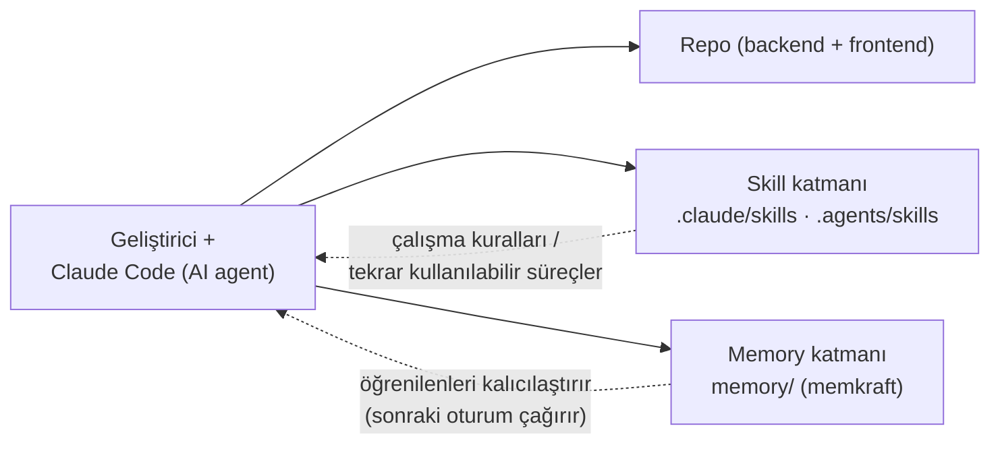

# 11 — Geliştirme Araçları

Repo, ürünün (`backend/` + `frontend/`) yanında bir **AI destekli geliştirme altyapısı** da içerir. Bu katman ürünün **parçası değildir** — geliştirme sürecinde kullanılan araçlardır. "Tüm repo" teslim edildiği için burada belgelenir.

> Amaç: şeffaflık. Değerlendirme ürünü yaparken, repo neden bu kadar geniş ve bu dosyalar ne — bu soruların yanıtı burada.

## Genel bakış

## 1) Claude Code + ponytail kuralları

- **`CLAUDE.md`** — her oturumda otomatik okunan proje rehberi. İçinde "ponytail, lazy senior dev mode" kural seti: yazılacak en az kodu bulmak için bir öncelik merdiveni (YAGNI → mevcut helper'ı yeniden kullan → stdlib → platform özelliği → kurulmuş bağımlılık → tek satır → en az kodu yaz) ve kök-neden odaklı hata düzeltme disiplini.
- Ayrıca DocTick'e özel notlar: teknoloji yığını, memkraft kullanım zorunluluğu, agent skills kaynağı.

## 2) memkraft — memory katmanı

[memkraft](https://github.com/seoapi) v3.0.3: proje-local, düz Markdown, zero-dependency bir "agent memory". `memory/` klasöründe:

- `facts/`, `decisions/`, `entities/` — yapılandırılmış bilgi (bitemporal facts, kararlar).
- `live-notes/` — canlı proje notu (otomatik takip).
- `sessions/` — oturum günlükleri (JSONL).

AI agent (Claude Code) bir görev bitiminde öğrendiklerini buraya yazar; bir sonraki oturumda geri çağırır. Bu, "projeyi her seferinde sıfırdan yeniden anlama" maliyetini düşürür. CLI proje-local Python venv'i (`.venv/`) üzerinden `PYTHONUTF8=1` ile çağrılır (Türkçe cp1254 konsolunda emoji/Unicode hatasını önlemek için).

## 3) Skills katmanı

[mattpocock/skills](https://github.com/mattpocock/skills) — `skills.sh --copy` ile kurulmuş 41 adet tekrar kullanılabilir süreç (örn. `tdd`, `domain-modeling`, `debugging`, `code-review`). Gerçek dosyalar `.claude/skills/` + `.agents/skills/` içinde, repoya commit edilmiş. Bu dökümantasyon da `grill-with-docs` skill'i ile üretildi.

## Repo içindeki diğer dosyalar

| Dosya/Klasör | Görev |
|---|---|
| `PONYTAIL-KILAVUZ.md`, `IMPECCABLE-KILAVUZ.md` | Skill rehberleri (Türkçe) |
| `data/skills/`, `skills/` | Skill kopyaları |
| `scripts/check_memkraft.py` | memory katmanı doğrulama betiği |
| `*.txt` | geliştirme notları (tasarım iyileştirmesi, Google client id) |
| `admin.url`, `kullanici.url` | tarayıcı kısayolları |

## Teslim için tavsiye

Eğer jüri yalnızca **ürünü** değerlendirecekse, bu araç katmanını teslimden ayırmak temiz bir paket verir:

- Tut: `backend/`, `backend.Tests/`, `frontend/`, `docs/`, `CONTEXT.md`, `baslat.bat`, `.gitignore`, `README.md`.
- Ayır (opsiyonel): `.claude/`, `.agents/`, `data/`, `skills/`, `memory/`, `.venv/`, `scripts/`, `CLAUDE.md`, `*.md` kılavuzlar.

Bu dökümantasyon (bu belge dahil) ürünün parçasıdır ve teslimde kalır.
