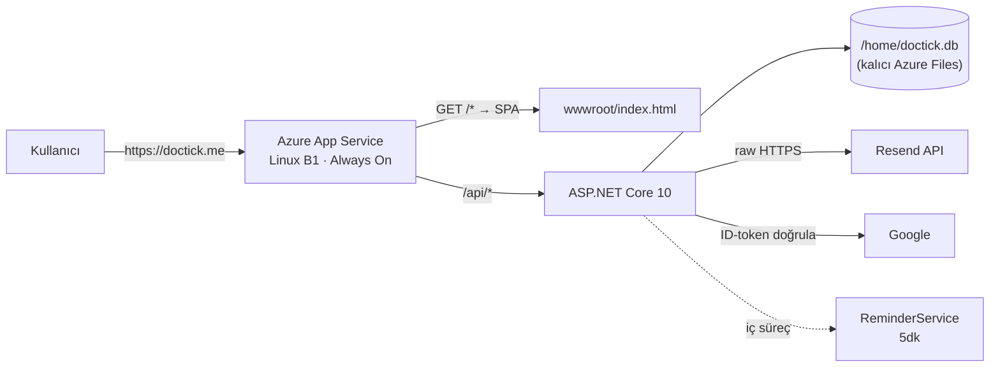

# 12 — Azure Deployment (doctick.me)

> Durum: plan · Hedef: `https://doctick.me` · Abonelik: Azure ($100 kredi)

## Karar: tek App Service, tek origin

DocTick zaten **tek origin** için tasarlanmış: `Program.cs` hem SPA'yı (`wwwroot` + `MapFallbackToFile`) hem `/api`'yi servis ediyor, frontend istekleri relative (`client.ts` → `fetch('/api/...')`). Bu yüzden uygulama **olduğu gibi** tek bir App Service'e gider — CORS yok, cookie `SameSite=Lax` çalışır, ikinci deploy hattı yok.

GitHub Pages elendi: statik-only, .NET runtime + SQLite + `ReminderService` (BackgroundService) çalıştıramaz. Pages+Azure bölmesi ise CORS + `SameSite=None` refactor'ü gerektirirdi — sıfır kazanç.



### Neden B1, Free F1 değil

| İhtiyaç | F1 (ücretsiz) | **B1 (~$13/ay)** |
|---|---|---|
| Özel domain (`doctick.me`) | ❌ yok | ✅ |
| Ücretsiz Managed SSL sertifikası | ❌ yok | ✅ (otomatik yenilenir) |
| **Always On** | ❌ 20 dk sonra uygulama uyur | ✅ |
| Günlük CPU kotası | 60 dk/gün | sınırsız |

**Always On kritik**: `ReminderService` bir `BackgroundService`. F1'de uygulama boşta kalınca boşaltılır → hatırlatma e-postaları durur. Yani B1 sadece domain için değil, **fonksiyonun doğru çalışması** için gerekli.

**Maliyet:** B1 ~$13/ay + ücretsiz sertifika + ücretsiz domain bağlama ≈ **$100 kredi ile ~7,5 ay.**

---

## Faz 0 — Prod-blocker kod değişiklikleri

Bunlar deploy'dan **önce** yapılmalı; ikisi gerçek bug, ikisi konfigürasyon.

### 0.1 Saat dilimi (gerçek bug, en kritik) ⚠️

Randevu mantığının tamamı `DateTime.Now` kullanıyor:

| Dosya | Ne yapıyor |
|---|---|
| `backend/Endpoints/PatientEndpoints.cs:44` | "Geçmiş tarihe randevu alınamaz" kontrolü |
| `backend/Endpoints/PatientEndpoints.cs:136,151` | İptal penceresi + `done` durumu türetme |
| `backend/Endpoints/PublicEndpoints.cs:51` | Müsait slot filtresi |
| `backend/Endpoints/AdminEndpoints.cs:166` | `DateTime.Today` — bugünün randevuları |
| `backend/Services/ReminderService.cs:36` | Hatırlatma penceresi |

Azure App Service **varsayılan olarak UTC** çalışır. Türkiye UTC+3 → tüm bu kontroller **3 saat kayar**: saat 10:00 randevusu sabah 07:00–10:00 arasında "geçmiş" sayılır, hatırlatmalar 3 saat şaşar.

**Çözüm (kod değişikliği yok):** App Service ayarına ekle —
```
TZ = Europe/Istanbul
```
(Linux App Service. Windows'ta karşılığı `WEBSITE_TIME_ZONE = Turkey Standard Time`.)

Bu, ponytail merdiveni açısından doğru basamak: `DateTime.Now`'ları `TimeZoneInfo`'ya çevirmek onlarca satır diff demek; platform ayarı tek satır ve zaten tek bölgeye hizmet eden bir uygulama için doğru.

### 0.2 SQLite kalıcılığı (gerçek bug)

`appsettings.json` → `Data Source=doctick.db` = **çalışma dizini** = `/home/site/wwwroot`. Bu dizin **her deploy'da silinip yeniden yazılır** → tüm randevular ve kullanıcılar her deploy'da kaybolur.

**Çözüm:** DB'yi deploy'dan etkilenmeyen kalıcı alana taşı. App Setting olarak:
```
ConnectionStrings__Default = Data Source=/home/doctick.db
```
`/home` Azure Files üzerinde kalıcıdır ve deploy'la ezilmez. Kod değişikliği yok — `Program.cs:11` zaten config'ten okuyor.

> `ponytail:` SQLite + Azure Files (SMB) yalnız **tek instance** için güvenli — dosya kilidi ağ paylaşımında zayıf. Scale-out'u 1'de tut. Trafik artarsa tavan burası; çıkış yolu Azure Database for PostgreSQL (EF Core sağlayıcı değişimi, düşük maliyet — `docs/09` madde 6).

### 0.3 Auth log yolu

`backend/Auth/AuthAudit.cs:22` → `Directory.GetCurrentDirectory()/logs`. Aynı sebeple her deploy'da silinir. Denetim kaydı olarak tutuluyorsa `/home/LogFiles/auth/` altına alınmalı (tek satır: `GetCurrentDirectory()` yerine env'den okunabilir bir kök). Düşük öncelik — kaybı veri kaybı değil, iz kaybı.

### 0.4 Gerçek istemci IP'si (opsiyonel)

`AuthAudit` `ctx.Connection.RemoteIpAddress` yazıyor; Azure'un reverse proxy'si arkasında bu **Azure'un iç IP'si** olur. Gerçek IP için `Program.cs`'e auth'tan önce:
```csharp
app.UseForwardedHeaders(new ForwardedHeadersOptions {
    ForwardedHeaders = ForwardedHeaders.XForwardedFor | ForwardedHeaders.XForwardedProto
});
```
Cookie'ler bunsuz da çalışır (`SecurePolicy.Always` şemaya bakmaz, koşulsuz Secure işaretler) — bu yalnızca log doğruluğu için.

---

## Faz 1 — Azure kaynakları

Azure CLI ile (portal'dan da yapılabilir). `az login` interaktif olduğu için bunu sen çalıştır:

```bash
az login

# Değişkenler
RG=doctick-rg
PLAN=doctick-plan
APP=doctick            # → doctick.azurewebsites.net (global benzersiz olmalı)
LOC=westeurope         # Türkiye'ye en yakın düşük gecikmeli bölge

az group create -n $RG -l $LOC
az appservice plan create -g $RG -n $PLAN --is-linux --sku B1
az webapp create -g $RG -p $PLAN -n $APP --runtime "DOTNETCORE|10.0"
az webapp config set -g $RG -n $APP --always-on true --number-of-workers 1
```

> **.NET 10 runtime doğrulaması:** önce `az webapp list-runtimes --os linux` çıktısında `DOTNETCORE|10.0` var mı bak. Yoksa **self-contained** yayınla (`dotnet publish -r linux-x64 --self-contained`) — runtime'ı uygulamayla birlikte taşırsın, platform sürümünden bağımsız olursun.

---

## Faz 2 — doctick.me + ücretsiz SSL

### 2.1 DNS kayıtları (domain kayıt firmanın panelinde)

| Tip | Ad | Değer |
|---|---|---|
| A | `@` | App Service inbound IP (`az webapp show ... --query inboundIpAddress`) |
| TXT | `asuid` | Domain doğrulama ID'si (`customDomainVerificationId`) |
| CNAME | `www` | `doctick.azurewebsites.net` |
| TXT | `asuid.www` | Aynı doğrulama ID'si |

```bash
az webapp show -g $RG -n $APP --query inboundIpAddress -o tsv
az webapp show -g $RG -n $APP --query customDomainVerificationId -o tsv
```

### 2.2 Domain bağla + ücretsiz sertifika

DNS yayıldıktan sonra (`nslookup doctick.me` ile teyit et):

```bash
az webapp config hostname add -g $RG --webapp-name $APP --hostname doctick.me
az webapp config hostname add -g $RG --webapp-name $APP --hostname www.doctick.me

# Ücretsiz App Service Managed Certificate (otomatik yenilenir)
az webapp config ssl create -g $RG --name $APP --hostname doctick.me
az webapp config ssl create -g $RG --name $APP --hostname www.doctick.me
# Dönen thumbprint ile bind:
az webapp config ssl bind -g $RG -n $APP --certificate-thumbprint <THUMBPRINT> --ssl-type SNI

# HTTP → HTTPS zorla (cookie SecurePolicy.Always ile uyumlu)
az webapp update -g $RG -n $APP --https-only true
```

---

## Faz 3 — Yapılandırma ve sırlar

`appsettings.json`'daki `Resend:ApiKey` şu an yer tutucu (`re_BURAYA_...`) — **gerçek anahtar repoya hiç girmemeli**. ASP.NET Core config sırası ortam değişkenlerini dosyanın üzerine yazar (`docs/09`, çift alt çizgi = bölüm ayracı), yani **sıfır kod değişikliği**:

```bash
az webapp config appsettings set -g $RG -n $APP --settings \
  TZ="Europe/Istanbul" \
  ConnectionStrings__Default="Data Source=/home/doctick.db" \
  Resend__ApiKey="<gerçek-resend-anahtarı>" \
  Resend__FromEmail="randevu@doctick.me" \
  Resend__RedirectTo="" \
  Admin__Email="tahakeskin06@hotmail.com" \
  AllowedHosts="doctick.me;www.doctick.me"
```

- `Resend__RedirectTo=""` → test köprüsü kapanır, e-postalar **gerçek alıcıya** gider (Faz 5.2'den sonra).
- `Google__ClientId` public bir değer, `appsettings.json`'da kalabilir.
- `ASPNETCORE_ENVIRONMENT` **Production** kalmalı — `Program.cs:57` sayesinde `/scalar` ve `/openapi` yalnız Development'ta açılır, yani API şeması prod'da otomatik kapalı. ✅

---

## Faz 4 — Deploy hattı (GitHub Actions)

Remote mevcut: `github.com/tahakeskin53/DocTick`. Deploy'un iki adımı var, çünkü SPA backend'in içinden servis ediliyor: **frontend build → `backend/wwwroot` → dotnet publish**.

`.github/workflows/azure-deploy.yml`:

```yaml
name: Deploy to Azure
on:
  push:
    branches: [main]
  workflow_dispatch:

jobs:
  deploy:
    runs-on: ubuntu-latest
    steps:
      - uses: actions/checkout@v4

      - uses: actions/setup-node@v4
        with: { node-version: '22', cache: 'npm', cache-dependency-path: frontend/package-lock.json }
      - run: npm ci
        working-directory: frontend
      - run: npm run build
        working-directory: frontend
        env:
          VITE_GOOGLE_CLIENT_ID: ${{ vars.VITE_GOOGLE_CLIENT_ID }}

      # SPA → backend/wwwroot (gitignored; Program.cs buradan servis eder)
      - run: |
          rm -rf backend/wwwroot
          cp -r frontend/dist backend/wwwroot

      - uses: actions/setup-dotnet@v4
        with: { dotnet-version: '10.x' }
      - run: dotnet publish backend/DocTick.Api.csproj -c Release -o publish

      - uses: azure/webapps-deploy@v3
        with:
          app-name: doctick
          publish-profile: ${{ secrets.AZURE_WEBAPP_PUBLISH_PROFILE }}
          package: publish
```

**Gerekli GitHub ayarları:**
- Secret `AZURE_WEBAPP_PUBLISH_PROFILE` ← `az webapp deployment list-publishing-profiles -g $RG -n $APP --xml` çıktısının tamamı
- Variable `VITE_GOOGLE_CLIENT_ID` ← Vite env'i **build anında** gömer; runtime App Setting olarak vermek işe yaramaz.

> İlk deploy'u Actions kurmadan önce elle denemek istersen: `dotnet publish` sonrası `az webapp deploy -g $RG -n $APP --src-path publish.zip --type zip`.

---

## Faz 5 — Dış servisler

### 5.1 Google OAuth Console

Yetkili **JavaScript kaynaklarına** ekle (`docs/09` madde 5):
```
https://doctick.me
https://www.doctick.me
```
`http://localhost:5173`'ü **silme** — geliştirme onunla çalışıyor (`vite.config.ts:53`, strictPort). Yönlendirme URI'si gerekmiyor: akış ID-token tabanlı (`AuthEndpoints.cs:32`), redirect kullanmıyor.

### 5.2 Resend domain doğrulaması (artık mümkün)

Şu an `onboarding@resend.dev` + `RedirectTo` köprüsüyle **tüm e-postalar tek adrese** gidiyor — yani hiçbir hasta kendi onay/hatırlatma postasını almıyor. `doctick.me` senin olduğu için bu kısıt kalkıyor:

1. Resend → Domains → `doctick.me` ekle
2. Verilen SPF/DKIM/DMARC kayıtlarını DNS'e gir
3. Doğrulanınca `Resend__FromEmail=randevu@doctick.me`, `Resend__RedirectTo=""` (Faz 3'te ayarlandı)

Bu, domaini almanın en somut fonksiyonel kazancı: e-posta akışı ilk kez gerçekten çalışır.

---

## Doğrulama listesi

Deploy sonrası sırayla:

| # | Kontrol | Beklenen |
|---|---|---|
| 1 | `https://doctick.me` | SPA açılır, yeşil kilit, `www` ve `http` → HTTPS'e yönlenir |
| 2 | `https://doctick.me/scalar` | **404** (prod'da kapalı olmalı) |
| 3 | Google ile giriş | Cookie yazılır, `/api/auth/me` 200 |
| 4 | **Saat dilimi**: bugün için 1 saat sonrasına randevu al | Kabul edilir (UTC olsaydı "geçmiş" der veya slot görünmezdi) |
| 5 | Onay e-postası | Gerçek adrese ulaşır, konuda `[→ ...]` eki **yok** |
| 6 | **Kalıcılık**: boş commit at → redeploy → randevuya bak | Randevu **durur** (0.2 doğrulanır) |
| 7 | Hatırlatma | `ReminderHoursBefore` içine düşen randevuya ≤5 dk'da e-posta |
| 8 | PWA | Telefonda "Ana ekrana ekle", offline'da `/randevularim` cache'ten açılır |
| 9 | `az webapp log tail -g $RG -n $APP` | Startup hatası yok, `EnsureCreated` + seed geçti |

4. ve 6. maddeler Faz 0'ın iki bug'ının kanıtı — atlanmamalı.

---

## Riskler

| Risk | Etki | Önlem |
|---|---|---|
| App Service'te .NET 10 runtime yok | Deploy patlar | `az webapp list-runtimes` ile önden bak; yoksa self-contained publish |
| SQLite + Azure Files kilit sorunu | Nadir yazma hatası | Tek instance (`--number-of-workers 1`), scale-out yok |
| Kredi bitişi (~7,5 ay) | Uygulama durur | Portal'da bütçe uyarısı kur; bitince F1'e in (domain kaybı) veya PostgreSQL'siz kal |
| `EnsureCreated` şema taşımaz | Model değişirse prod DB güncellenmez | Model sabitleşince EF migrations (`docs/09` madde 7, ADR-0001) |
| Publish profile sızması | Deploy yetkisi çalınır | Yalnız GitHub Secret; kredential rotasyonu için `--xml` yeniden üret |

## Uygulama sırası

```
Faz 0.1 + 0.2 (config kararı)  →  Faz 1 (kaynaklar)  →  Faz 3 (ayarlar)
   →  Faz 4 (ilk deploy, azurewebsites.net üzerinde doğrula)
   →  Faz 5.1 (Google origin: önce azurewebsites.net ile test)
   →  Faz 2 (DNS + domain + SSL)   →  Faz 5.1 tekrar (doctick.me origin ekle)
   →  Faz 5.2 (Resend domain)      →  Doğrulama listesi
```

Domain'i **en sona bırakmak** kasıtlı: DNS yayılımı beklenirken uygulamayı `doctick.azurewebsites.net` üzerinde tam olarak çalışır hale getirirsin, böylece bir sorun çıktığında DNS mi kod mu belirsizliği olmaz.
